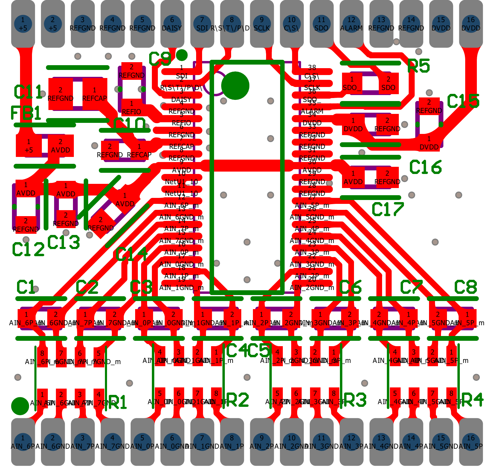
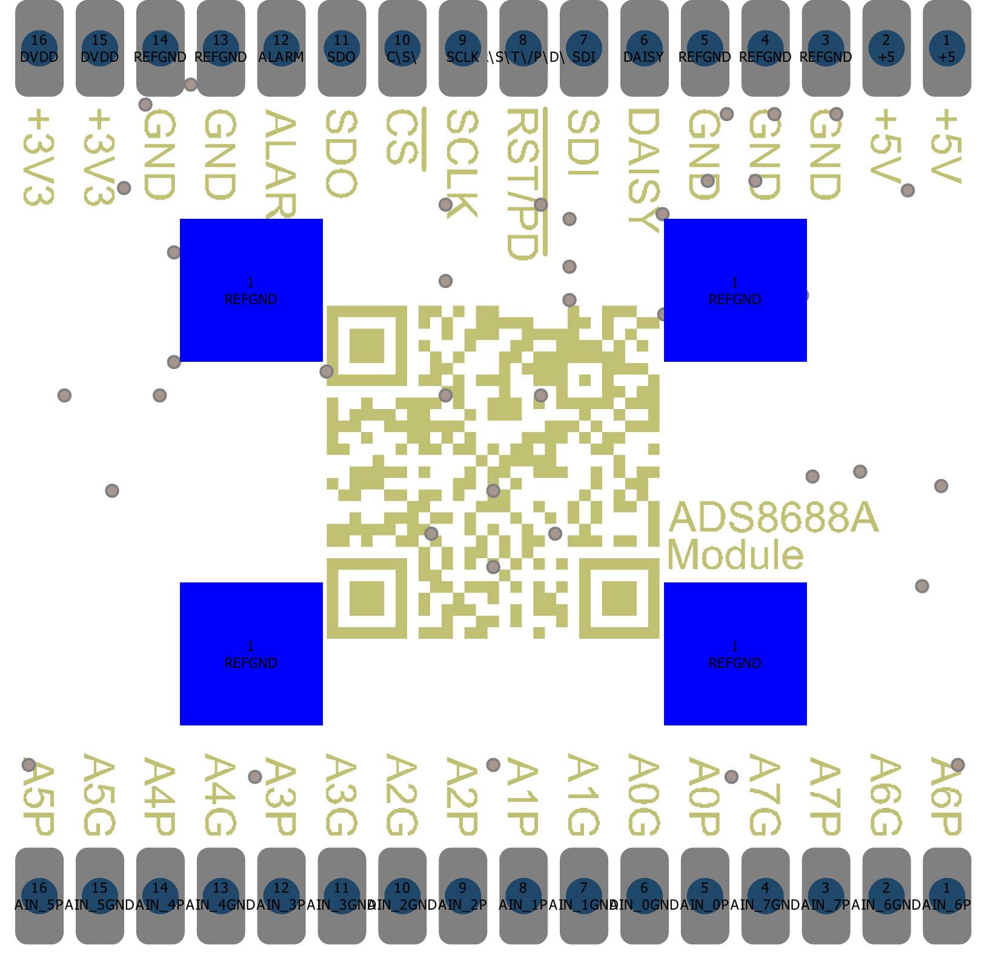
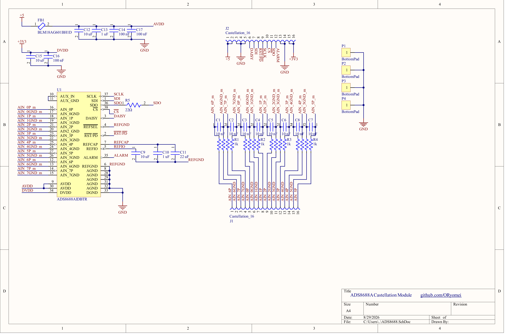

# ADS8688A ADC Module

English | [日本語](README.ja.md)

Compact 8-channel, 16-bit ADC module based on the Texas Instruments
[ADS8688A](https://www.ti.com/product/ADS8688A) (ADS8688AIDBTR, TSSOP-38).

The module moves the relatively sensitive and repetitive circuitry around the
ADS8688A — analog input filtering, reference decoupling, and power
filtering/decoupling — onto a small reusable PCB, so that carrier boards
(Teensy, Raspberry Pi, custom MCU boards, ...) do not need to redesign the ADC
front end each time. It mounts to a carrier PCB via castellated (half-hole)
edge pads.

<p align="center">
  
  
</p>

*Layout images (top / bottom) with the GND copper pours hidden for clarity —
on the actual board, both layers are flooded with GND (the bottom layer is an
essentially continuous ground plane).*

> **Note:** This design targets the ADS8688**A**, but the older ADS8688 can
> also be fitted: the relevant difference is pin 35, which is `ALARM` on the
> ADS8688A and DNC on the ADS8688. With an ADS8688 mounted, the module works
> normally except that the `ALARM` output is non-functional.

## Features

- Texas Instruments ADS8688A: 8 channels, 16-bit, up to 500 kSPS aggregate,
  SPI interface, programmable input ranges, internal 4.096 V reference
- Ground-sense analog inputs — each channel has its own `AIN_xP` / `AIN_xGND`
  pair, tolerant of small differences between sensor ground and ADC ground
- On-board RC input filter on every channel (1 kΩ + 1 kΩ + 10 nF differential)
- On-board reference decoupling (internal-reference operation)
- On-board AVDD/DVDD decoupling and ferrite-bead filtering of the analog supply
- On-board SDO source-series termination (22 Ω)
- Powered from carrier-board 5 V (analog) and 3.3 V (digital / I/O level)
- Approximately 20 mm × 20 mm, two-layer PCB
- 16 castellated pads per edge (analog edge + digital/power edge)
- Four optional exposed GND pads on the bottom side

---

# Using the Module

This section covers what you need to integrate the finished module into a
carrier board. For register-level programming, refer to the
[ADS8688A datasheet](https://www.ti.com/lit/ds/symlink/ads8688a.pdf).

## Pinout

The module has two rows of 16 castellated pads. Pin numbers below are as seen
from the top side, and should be cross-checked against the images in
`images/` and `ADS8688A_Module.PDF` before laying out a carrier footprint.
The round silkscreen marker on the top side sits next to pin 1 of the analog
edge (`AIN_6P`).

**Digital / power edge:**

| Pad | Signal | Dir | Notes |
| ---:| --- | --- | --- |
| 1, 2 | `5V` | in | Analog supply (AVDD, via on-board ferrite bead) |
| 3–5 | `GND` | — | Module ground |
| 6 | `DAISY` | in | Daisy-chain data input; may be left unused in single-device setups |
| 7 | `SDI` | in | SPI data in (MOSI) |
| 8 | `RST/PD` | in | Active-low reset / power-down |
| 9 | `SCLK` | in | SPI clock |
| 10 | `CS` | in | Active-low chip select |
| 11 | `SDO` | out | SPI data out (MISO); 22 Ω series resistor on module |
| 12 | `ALARM` | out | Alarm / threshold-monitor output |
| 13, 14 | `GND` | — | Module ground |
| 15, 16 | `3V3` | in | Digital supply (DVDD); sets digital I/O level |

**Analog edge:**

| Pad | Signal | | Pad | Signal |
| ---:| --- | --- | ---:| --- |
| 1 | `AIN_6P` | | 9 | `AIN_2P` |
| 2 | `AIN_6GND` | | 10 | `AIN_2GND` |
| 3 | `AIN_7P` | | 11 | `AIN_3GND` |
| 4 | `AIN_7GND` | | 12 | `AIN_3P` |
| 5 | `AIN_0P` | | 13 | `AIN_4GND` |
| 6 | `AIN_0GND` | | 14 | `AIN_4P` |
| 7 | `AIN_1GND` | | 15 | `AIN_5GND` |
| 8 | `AIN_1P` | | 16 | `AIN_5P` |

> **Caution:** The P/GND ordering is **not** the same for every channel
> (e.g. `AIN_0P` comes before `AIN_0GND`, but `AIN_1GND` comes before
> `AIN_1P`). Follow the table and the silkscreen, not an assumed pattern.

In addition, four exposed GND pads on the bottom side may optionally be
soldered to the carrier board (see [Bottom GND Pads](#bottom-gnd-pads)).

## Power

| Signal | Voltage | Role |
| --- | ---: | --- |
| `5V` | 5 V | ADS8688A analog supply (AVDD) |
| `3V3` | 3.3 V | ADS8688A digital supply (DVDD) and digital I/O level |
| `GND` | 0 V | Common module ground |

All supply filtering and decoupling for the ADS8688A is on the module: the
5 V input passes through a ferrite bead to the local AVDD rail, and both AVDD
pins and DVDD have local decoupling. The ferrite bead is only a
high-frequency filter — it does **not** provide isolation, and the carrier
board is still responsible for reasonably clean, stable 5 V and 3.3 V rails.

Connect the module `GND` pads to a low-impedance ground plane on the carrier
board, using as many of the GND castellations as practical.

## Analog Inputs

Each channel exposes a pair of pins that go to the ADS8688A ground-sense
input stage:

```text
Sensor                          ADS8688A Module

Signal  ─────────────────────── AIN_xP
Sensor ground ───────────────── AIN_xGND
```

The ADC measures `AIN_xP` relative to its own `AIN_xGND`, which allows a
small difference between the remote sensor ground and the ADC's local
ground — useful in vehicles and other environments where sensor grounds and
controller grounds are not perfectly identical due to wiring resistance and
noise.

> **Important:** `AIN_xGND` is **not** the module `GND`. It is a per-channel
> analog ground-sense *input*. Do not use it as a general-purpose ground
> connection, and do not tie it to module `GND` as a substitute for wiring it
> back to the sensor ground.

Input RC filtering (1 kΩ in each leg, 10 nF differential) is already on the
module, so a typical carrier board needs no additional input components. See
[Analog Input Filter](#analog-input-filter) for details. For maximum input
voltage and range limits, refer to the ADS8688A datasheet and the configured
input range.

## SPI Interface

| Module | Host | Driven by |
| --- | --- | --- |
| `SCLK` | SPI clock | MCU |
| `SDI` | MOSI | MCU |
| `SDO` | MISO | ADS8688A |
| `CS` | Chip select | MCU |

### Series Termination

The module includes a source-series termination resistor **only on SDO**
(22 Ω). SDO is driven by the ADS8688A, and series termination belongs close
to the driver — so this resistor is correctly located on the module.

`SCLK`, `SDI`, and `CS` are driven by the host MCU, so the module
intentionally does **not** include series resistors for them. Where
termination is needed, place it on the carrier board close to the MCU output
pins:

```text
Carrier Board                          ADS8688A Module

MCU SCLK ──[R]───────────────────────── SCLK
MCU MOSI ──[R]───────────────────────── SDI
MCU CS   ──[R]───────────────────────── CS

MCU MISO ────────────────────────[R]─── SDO
           ^                      ^
      near the MCU        on the module, near the ADC
```

Series termination is not always mandatory. Whether it is needed — and the
appropriate value — depends on trace length, driver edge rate, and board
layout, not just on the SPI clock frequency. Evaluate it for your actual
carrier design.

## Additional Control Signals

| Pin | Direction | Description |
| --- | --- | --- |
| `RST/PD` | in | Active-low reset / power-down control. Normally a low-speed signal; does not need the same termination consideration as SCLK. |
| `ALARM` | out | Driven by the ADS8688A. Programmable high/low input-threshold monitoring; usable as an MCU interrupt/indication source. |
| `DAISY` | in | For ADS8688A daisy-chain configurations. May be left unused in ordinary single-device SPI applications. |

See the ADS8688A datasheet for register-level behavior.

## Carrier Board Layout Recommendations

- Use a continuous ground plane under the module where possible.
- Connect multiple module `GND` castellations to the carrier ground plane;
  optionally also solder the bottom GND pads for a lower-impedance connection.
- Keep SPI traces reasonably short; place any series termination close to the
  driving device (see above).
- Route each `AIN_xP` together with its `AIN_xGND` (ideally as a pair all the
  way to the sensor), and keep analog input routing away from fast digital
  signals.
- Do not use `AIN_xGND` as a ground connection.

## Altium Integrated Library

For carrier boards designed in Altium Designer, an integrated library of this
module (`ADS8688A_MODULE.IntLib` — schematic symbol plus a footprint
reproducing the castellated pad layout) is attached to
[GitHub Releases](../../releases). The source library package is in
`integration/`.

---

# Hardware Design

This section is for understanding, modifying, or manufacturing the module.
The full schematic and board documentation is in `ADS8688A_Module.PDF`.



## Analog Input Filter

Each channel has symmetric 1 kΩ series resistance in both the positive and
ground-sense paths, with a 10 nF differential capacitor between the ADC-side
nodes:

```text
module AIN_xP ────[ 1 kΩ ]────┬──── ADS8688A AIN_xP
                              │
                            10 nF
                              │
module AIN_xGND ──[ 1 kΩ ]────┴──── ADS8688A AIN_xGND
```

The matched impedance in the P and GND legs is intentional: it follows the
ADS8688A recommendation of matching source impedance on the positive and
ground-sense paths to reduce measurement error.

As a simplified first-order differential model (1 kΩ + 1 kΩ = 2 kΩ effective
differential resistance with 10 nF):

```text
τ  ≈ 2 kΩ × 10 nF ≈ 20 µs
fc ≈ 1 / (2π × 2 kΩ × 10 nF) ≈ 8 kHz
```

This is an approximation only — it ignores the ADS8688A's internal input
network — but it gives the right order of magnitude for the installed values.
The capacitor value can be changed to suit a different signal bandwidth.

The sixteen 1 kΩ resistors are implemented as four resistor networks
(4 isolated resistors per package) to save board area.

## Voltage Reference

The module uses the ADS8688A internal 4.096 V reference; `REFSEL` is
configured for internal-reference operation. The REFIO and REFCAP support
capacitors are on the module, placed very close to the ADC with short, wide
connections, and `REFGND` ties directly into the common ground plane.

`REFCAP` is the reference-buffer / ADC reference decoupling node — it is
**not** an external reference output, and REFIO/REFCAP/REFGND are not exposed
to the carrier board. A carrier board normally needs no external reference
components.

## Power Supply

The 5 V input feeds AVDD through a ferrite bead (high-frequency supply
filtering only — no isolation). Each of the two ADS8688A AVDD pins has its
own local 100 nF high-frequency decoupling, plus bulk/intermediate
capacitance on the AVDD rail. The 3.3 V input feeds DVDD directly, with local
decoupling at the pin.

Key components:

| Function | Value / Part |
| --- | --- |
| ADC | TI ADS8688AIDBTR (TSSOP-38) |
| Input resistor networks | 1 kΩ ×4 isolated, Bourns CAY16A-1001F4LF |
| Input filter capacitors | 10 nF, Murata GRT1885C1E103FA02D |
| HF decoupling | 100 nF 0603, Murata GCM188R91E104MA37J |
| Decoupling | 1 µF 0603, Murata GRT188R71E105KE13D |
| Bulk decoupling | 10 µF 0603, Murata GRT188R61E106ME13D |
| Reference bulk capacitor | 22 µF 0805, Murata GRT21BR61E226ME13L |
| Ferrite bead | Murata BLM18AG601BH1D |
| SDO series resistor | 22 Ω 0603, Yageo AC0603JR-0722RL |

## Grounding

The module deliberately uses **one common ground plane**. AGND, DGND, and
REFGND all connect to the same low-impedance module GND — there are no split
analog/digital ground domains, and none should be added on the carrier side
either. Return currents are managed by placement instead:

- Continuous bottom-layer GND plane, with essentially no signal routing on it
- Short local return paths and decoupling loops
- Ground vias placed at the AVDD/DVDD decoupling capacitors, reference
  capacitors, ADS8688A ground pins, and GND castellations, plus additional
  stitching vias
- Physical separation of digital routing from sensitive analog/reference
  routing where practical

Again: this common module GND is a different thing from the per-channel
`AIN_xGND` inputs.

## PCB Layout

Two-layer PCB, approximately 20 mm × 20 mm:

- **Top:** components, analog, digital, power, GND pour
- **Bottom:** essentially continuous GND plane

Layout priorities were short REFCAP/REFIO connections, tight decoupling
loops with adjacent ground vias, short analog input paths, and keeping the
SDO series resistor close to the ADS8688A.

---

# Mechanical / Carrier Integration

## Castellated Pads

The module mounts directly onto a carrier PCB via the castellated edge pads;
the carrier footprint must reproduce the module pad positions (see
`ADS8688A_Module.PDF` and the design files for exact geometry). It can be
attached by reflow, hot air, or hand soldering of the castellations.

## Bottom GND Pads

Four exposed pads on the bottom side connect to the module's bottom GND
plane. Soldering them to matching lands on the carrier board optionally
provides:

- an additional low-impedance GND connection,
- a better high-frequency return path, and
- extra mechanical attachment.

They are **not required** — the module works with only the castellated GND
connections, which keeps hand soldering practical. If you do solder them,
reflow or hot air is the realistic assembly method.

These pads are plain ground pads, not a thermal pad: the ADS8688A DBT
(TSSOP-38) package has no exposed PowerPAD.

---

# Manufacturing

The module uses standard SMT assembly. When ordering the module PCB, the
manufacturer must support castellated / half-hole edge plating — check their
specific requirements for castellation dimensions.

Ready-to-order fabrication data for released board revisions — Gerber + NC
drill (zip), BOM, and pick-and-place — is attached to
[GitHub Releases](../../releases). The design was created in Altium Designer,
so the same outputs can also be regenerated from the included OutJob.

# Repository Structure

```text
.
├── README.md
├── README.ja.md               # Japanese version of this README
├── LICENSE                    # CERN-OHL-P-2.0
├── ADS8688A_Module.PDF        # Schematic + board documentation (PDF output)
├── ads8688-module.PrjPcb      # Altium Designer project
├── ADS8688.SchDoc             # Schematic
├── ADS8688.PcbDoc             # PCB layout
├── ADS8688.SchLib             # Schematic library
├── ADS8688.PcbLib             # Footprint library
├── ADS8688-module.OutJob      # Output job (fabrication outputs)
├── integration/               # Altium library package — source of ADS8688A_MODULE.IntLib
│   ├── ADS8688A_MODULE.LibPkg
│   ├── ADS8688A_MODULE.SchLib
│   └── ADS8688A_MODULE.PcbLib
└── images/
    ├── schematic.png
    ├── pattern_top.png
    └── pattern_bottom.png
```

# Applications

- Vehicle data acquisition and ECU development
- Electronic throttle control
- Sensor logging
- Embedded control systems
- General-purpose multi-channel analog measurement on Raspberry Pi / Teensy /
  custom MCU carrier boards

The ADS8688A supports up to 500 kSPS aggregate throughput; the module does
not impose a fixed sample rate of its own.

# Disclaimer

This hardware is provided for development and experimental use. It carries no
automotive (AEC-Q100/Q200) qualification and no functional-safety
certification, even where individual components may be automotive-rated. Any
use in automotive, safety-critical, or other high-reliability systems
requires independent system-level validation for the intended operating
conditions, fault conditions, and failure modes.

# License

This project is licensed under the **CERN Open Hardware Licence Version 2 –
Permissive** (CERN-OHL-P-2.0). See the [`LICENSE`](LICENSE) file for the full
text.

Not a requirement, but if you build something with this module, I'd love to
hear about it — feel free to open an issue and share what you made.
